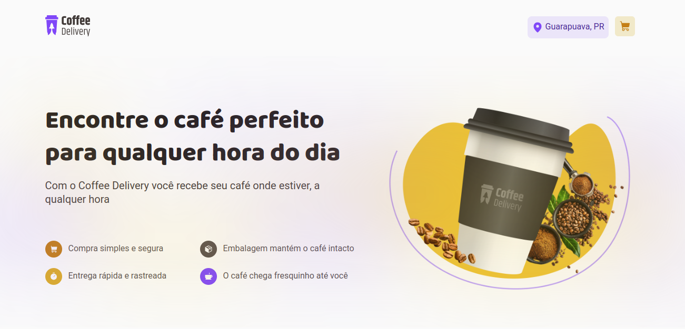
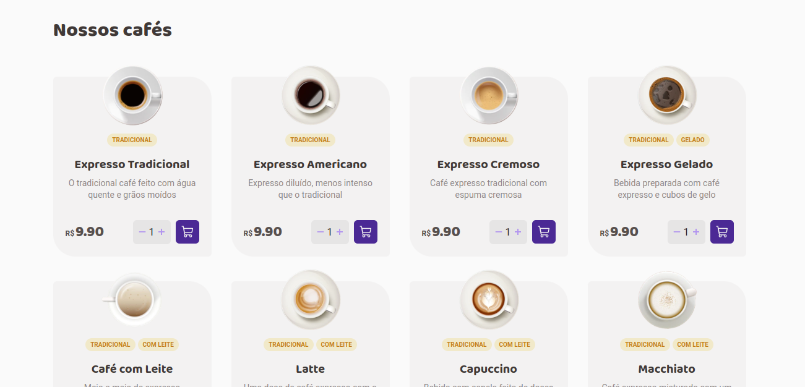
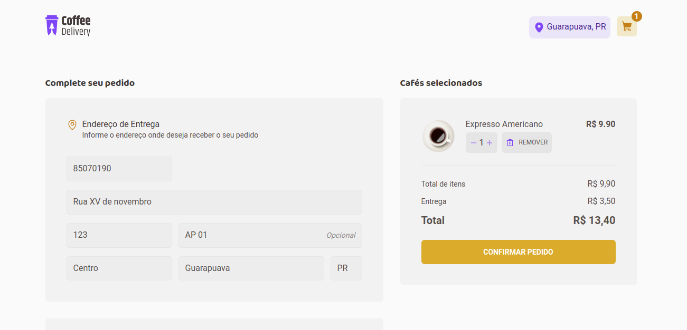
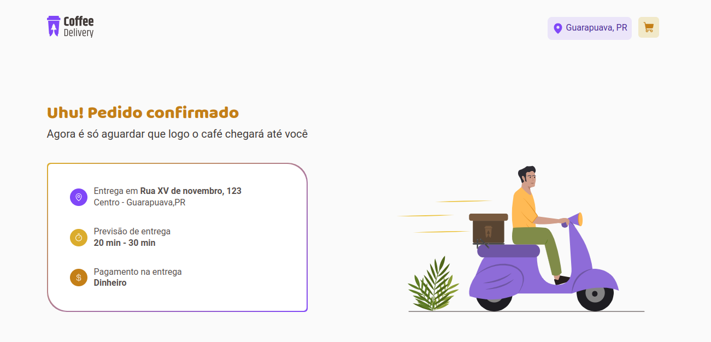

<div align="center">
  
</div>

###

O **Coffee Delivery** é uma aplicação de delivery local de cafés. Onde é possível simular todo o processo de compra, desde a escolha do café desejado até a finalização de compra.

<div align="center">
  
</div>

---

## Funcionalidades

- **Lista de cafés**: Na tela inicial, você tem uma variedade de cafés à sua escolha. Para cada opção você pode escolher a quantidade desejada e adicionar ao carrinho.

<div align="center">
  
</div>

---

- **Checkout**: Após adicionar pelo menos um produto no carrinho, você pode navegar até a página do carrinho clicando no botão do canto superior direito da página, onde você precisará inserir os dados de entrega e forma de pagamento. Todo o formulário dessa página é feito validação com react hook form, porém ainda não possui funcionalidade de cálculo de frete, só há a validação dos dados primitivos.

<div align="center">
  
</div>

---

- **Tela de sucesso**: Após o preenchimento correto do formulário de endereço de entrega e selecionar uma forma de pagamento, ao clicar em confirmar o pedido, o usuário é redirecionado para uma tela de sucesso onde ele pode visualizar os detalhes do seu endereço de entrega, com os dados que ele forneceu de endereço e a forma de pagamento.

<div align="center">
  
</div>

---

## Tecnologias Utilizadas
- [React](https://react.dev/)
- [TypeScript](https://www.typescriptlang.org/)
- [Styled Components](https://styled-components.com/)
- [Zod](https://zod.dev/)
- [immer](https://immerjs.github.io/immer/)
- [React Router](https://reactrouter.com/en/main)
- [React Hook Form](https://react-hook-form.com/)
- [Vite](https://vitejs.dev/)
- [Phosphor Icons](https://phosphoricons.com/)
- [Eslint](https://eslint.org/)

---

## Demonstração

[Clique aqui](https://coffee-delivery-lyart-nine.vercel.app/) para poder acessar o projeto online

---

## Instalação e Execução

Antes de começar, certifique-se de ter as seguintes ferramentas instaladas em seu sistema:

- [Node.js](https://nodejs.org/) (versão 18 ou superior, para esse projeto eu utilizei a versão 20.14.0)
- [npm](https://www.npmjs.com/) ou [Yarn](https://classic.yarnpkg.com/) (gerenciador de pacotes)

## Instalação

1. **Clone o Repositório**

   Se ainda não tiver o repositório clonado, faça isso com o comando:

- HTTPS:
   ```bash
   git clone https://github.com/edu-almeidaf/coffee-delivery.git
   ```

- SSH:
   ```bash
   git clone git@github.com:edu-almeidaf/coffee-delivery.git
   ```
##

2. **Navegue até o diretório do projeto**
   ```bash
   cd coffee-delivery
   ```
##

3. **Instale as dependências**

    Você pode instalar as dependências usando npm ou yarn:
- npm:
    ```bash
    npm install
    ```
- yarn:
    ```bash
    yarn install
    ```
##

4. **Rode o projeto**
- npm:
    ```bash
    npm run dev
    ```
- yarn:
    ```bash
    yarn dev
    ```

## Avisos:
- Caso opte por rodar o projeto com Yarn, remova o arquivo package-lock.json. Isso garantirá que o arquivo yarn.lock seja utilizado corretamente

- Esse projeto roda na porta **5173**. Caso já tenha outro serviço rodando nesta porta, pode facilmente substituir a porta dentro do arquivo `vite.config.ts`. Para isso, basta adicionar a chave `server` conforme o exemplo abaixo:

  ```bash
  import { defineConfig } from 'vite'
  import path from 'path'
  import react from '@vitejs/plugin-react'

  // https://vitejs.dev/config/
  export default defineConfig({
    plugins: [react()],
    resolve: {
      alias: {
        '@': path.resolve(__dirname, './src'),
      },
    },
    server: {
      port: 5173 //Número da porta desejada
    }
  })
  ```
---

## Futuras Implementações

- **Autenticação de Usuário**: Implementar um sistema de login e gerenciamento de usuários.
- **Integração com Backend**: Atualmente o projeto não possui backend, futuramente pretendo transformar essa aplicação em um projeto fullstack.
- **Tela de Histórico de pedidos**: Exibir para o usuário uma tela com o histórico dos pedidos feitos e um atalho para ele poder comprar novamente
- **Versão Mobile**: Desenvolver uma versão mobile da aplicação para proporcionar uma melhor experiência em dispositivos móveis.
- **Cálculo dinâmico de frete**: Permitir com que o usuário ao inserir seu CEP ele obtenha o valor do frete correspondente à distância em que ele se encontra do estabelecimento (Válido somente para frete local).
- **Testes Automatizados**: Implementar testes automatizados para garantir a qualidade do código.
---

## Contribuição

Contribuições são bem-vindas! Se você quiser sugerir melhorias, relatar bugs ou contribuir com código, siga estas etapas:

1. Faça um fork do repositório.
2. Crie uma branch com a nova funcionalidade ou correção de bug: `git checkout -b feature/nova-funcionalidade`.
3. Commit suas mudanças: `git commit -m 'Adiciona nova funcionalidade'`.
4. Envie para a branch original: `git push origin feature/nova-funcionalidade`.
5. Abra um Pull Request.

---

## Contato

Se você tiver dúvidas ou sugestões, entre em contato:

- Email: [eduardoa.fernandes@hotmail.com](mailto:eduardoa.fernandes@hotmail.com)
- LinkedIn: [Eduardo de Almeida Fernandes](https://linkedin.com/in/almeidaedu)

---

## Licença

Este projeto está licenciado sob os termos da [MIT License](./LICENSE).